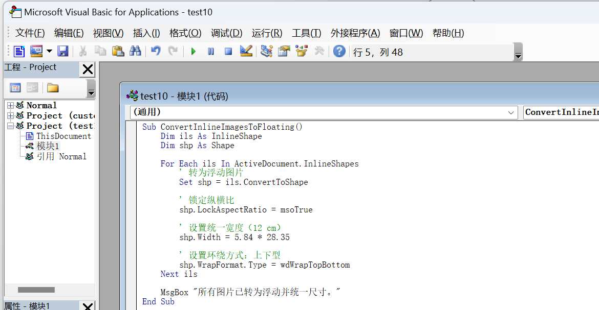
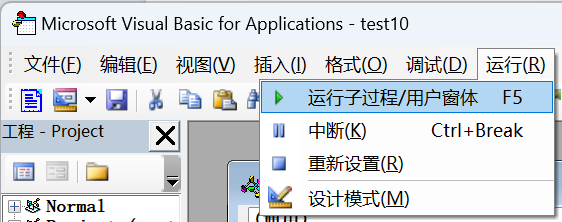

# 核舟记制作教程

pandoc导出的docx图片都是嵌入式的
这个时候进入word/wps
按住`alt+f11`进入



后插入模块


粘贴如下代码
```
Sub ConvertInlineImagesToFloating()
    Dim ils As InlineShape
    Dim shp As Shape

    For Each ils In ActiveDocument.InlineShapes
        ' 转为浮动图片
        Set shp = ils.ConvertToShape
        
        ' 锁定纵横比
        shp.LockAspectRatio = msoTrue
        
        ' 设置统一宽度	5.84是窄边距三列的宽
        shp.Width = 5.84 * 28.35
        
        ' 设置环绕方式：上下型
        shp.WrapFormat.Type = wdWrapTopBottom
    Next ils

    MsgBox "所有图片已转为浮动并统一尺寸。"
End Sub
```

随后运行即可



后续改宽度

```
Sub ResizeAllFloatingImages()
    Dim shp As Shape

    For Each shp In ActiveDocument.Shapes
        ' 只处理图片，跳过文本框等
        If shp.Type = msoPicture Then
            shp.LockAspectRatio = msoTrue
            shp.Width = 5.84 * 28.35   ' 5.84 cm
            shp.WrapFormat.Type = wdWrapTopBottom
        End If
    Next shp

    MsgBox "所有浮动图片已重新调整完成。"
End Sub
```

